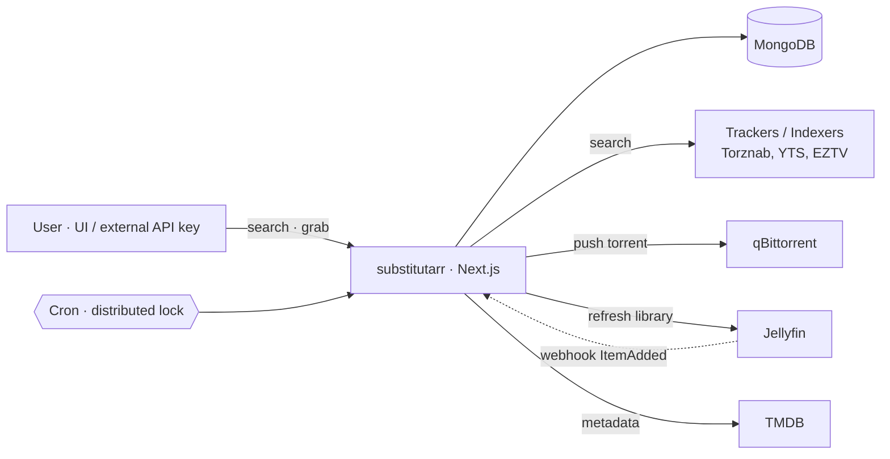

<div align="center">
  <h1>substitutarr</h1>
  <p><i>Your *arr stack, in one Next.js app — with explainable scoring.</i></p>
  <p>
    <a href="#quick-start">Quick start</a> ·
    <a href="#how-it-works">How it works</a> ·
    <a href="#vs-the-arr-stack">vs *arr</a> ·
    <a href="https://github.com/PhytoPlancton/substitutarr/issues">Issues</a>
  </p>

  <p>
    <a href="https://github.com/PhytoPlancton/substitutarr/actions"></a>
    <a href="https://github.com/PhytoPlancton/substitutarr/releases"></a>
    <a href="LICENSE"></a>
    <a href="https://github.com/PhytoPlancton/substitutarr/stargazers"></a>
    
  </p>

  <p>
    
    
    
  </p>

  <p>
    <sub><b>1 app</b> · <b>0 extra containers</b> · <b>15 scoring dimensions</b> · <b>5 default profiles</b></sub>
  </p>
</div>

---

## What & why

The *arr stack is brilliant — but it's three Docker containers, three SQLite databases, three UIs, and a config drift waiting to happen. **substitutarr does the same job in one Next.js app**, with a scoring engine that actually tells you *why* a release was picked.

```text
  Dune.Part.Two.2024.MULTi.2160p.UHD.BluRay.REMUX.DV.DTS-HD.MA.7.1.HEVC-FraMeSToR     Score: 402  ✓ grabbed
  ─────────────────────────────────────────────────────────────────────────────────────────────────────────
   resolution    2160p              +100
   source        BLURAY (REMUX)     +80
   codec         HEVC               +20
   hdr           Dolby Vision       +30
   audio         DTS-HD MA 7.1      +30
   language      MULTi              +60
   tag           REMUX              +5
   seeders       ×42                +27
   group         FraMeSToR (tier-1) +50
   ─────────────────────────────────────────
   Reference 4K Atmos      ✓ matched, 8 candidates · 1 kept
```

That's what every grab decision looks like. Live. Per release. With every reason.

---

## How it works



User adds a movie · substitutarr queries every enabled indexer in parallel · parses each release on 15 dimensions · scores them through the active profile · picks the best · pushes to qBittorrent with the right cookie/category · the cron loop reconciles state and triggers Jellyfin scans on completion.

---

## Quick start

```bash
git clone https://github.com/PhytoPlancton/substitutarr
cd substitutarr
cp .env.example .env.local         # fill TMDB, Mongo, qBit, Clerk
docker run -d -p 27017:27017 --name substitutarr-mongo mongo:7
npm install
npm run dev
```

Open [http://localhost:3000](http://localhost:3000). Five default profiles seed on first run. Clerk is optional — without it, the app runs in single-user dev mode.

---

## Features

### Search & explain
Every search shows you the full release list, **scored across 15 dimensions**, with a human-readable reason for every rejected candidate. No more *"why didn't it grab the 4K REMUX"* mystery.

### Profiles that actually fall back
`Reference 4K Atmos` → `1080p Balanced` → `Storage Saver 720p`. If the top profile finds nothing, the chain takes over — cycle-safe, max 5 hops, configurable per item.

### One app, zero extra containers
Replaces Sonarr + Radarr + Prowlarr. One Mongo, one Next.js process, one UI. One file to grep when something breaks.

### Localized metadata
TMDB localization · multi-variant query (apostrophes · `:` separators · accents) · `alt_titles` fallback for non-Latin originals (anime, foreign films) · multi-language audio/subs tags handled natively (any combination of dub/sub flags from the release name).

<details>
<summary><b>And 12 more</b> — multi-user with API keys, Jellyfin webhooks, SSRF guard, distributed cron lock…</summary>

- **Multi-user** with Clerk · scoped, rate-limited, expirable API keys for external sites to push movie/TV requests
- **External request API** — `POST /api/external/request` with `Authorization: Bearer ars_…` lets your streaming site push grabs straight in
- **qBittorrent v5+** compat with auto-relogin SID · race-safe add → info polling · category cookie passing for private trackers
- **Distributed cron lock** prevents overlapping reconcile sweeps · soft-deletes profiles so in-flight grabs survive
- **External-delete reconciliation** — torrents deleted in qBit UI are detected and reflected back to substitutarr state
- **SSRF guard** on user-provided indexer URLs · refuses RFC1918, loopback, link-local, AWS metadata
- **Secret log redaction** — Torznab API keys, qBit passwords, Mongo URIs scrubbed before any log emit
- **Strict CSP / HSTS / X-Frame-Options** in `next.config.ts`
- **Health endpoint** — `/api/health?deep=1` probes Mongo, qBittorrent and Jellyfin
- **Jellyfin webhook receiver** for `ItemAdded` events · HMAC-verified
- **Partial unique index** on `Profile.isDefault` — structurally impossible to have two defaults
- **TMDB cache** — Mongo TTL 24h, protects upstream rate limit

</details>

---

## vs the *arr stack

|                              | *arr (Sonarr + Radarr + Prowlarr) |  substitutarr  |
| :--------------------------- | :-------------------------------: | :------------: |
| Containers to run            |                3+                 |       1        |
| Databases                    |          3 (SQLite each)          |   1 (Mongo)    |
| Localized metadata first     |          Plugin / manual          |    Built-in    |
| Score explainability         |              Limited              | Per-release    |
| External API for clients     |              Limited              |  First-class   |
| Multi-user                   |                No                 |  Yes (Clerk)   |
| Maturity                     |    10+ years, battle-tested       |     Young      |

substitutarr is **not** trying to dethrone the *arr stack — it's a different tradeoff: simpler ops, opinionated for private trackers, with scoring you can actually read.

---

## Built with

Next.js 15 · TypeScript · MongoDB + Mongoose · Clerk · TanStack Query · Tailwind · lucide-react · TMDB · qBittorrent Web API · Jellyfin API · xml2js · zod

---

## Roadmap

- [x] Multi-user with API keys
- [x] Score-based fallback chains
- [x] Search & explain modal
- [x] Localized metadata pipeline
- [ ] Plex support (alongside Jellyfin)
- [ ] Sonarr / Radarr import wizard
- [ ] Per-user notification rules (Slack, Discord, ntfy)
- [ ] Anime absolute numbering (TVDB / AniList mapping)

Track in [Issues](https://github.com/PhytoPlancton/substitutarr/issues).

---

## Contributing

PRs welcome. Open an issue first for anything beyond a typo.

## Thanks

- [Sonarr](https://sonarr.tv), [Radarr](https://radarr.video), [Prowlarr](https://prowlarr.com) — substitutarr stands on years of patterns pioneered by the *arr team
- [TMDB](https://themoviedb.org) for the metadata
- [Jellyfin](https://jellyfin.org) for being the open-source media server we deserve

## License

[MIT](./LICENSE)

## Disclaimer

substitutarr is a media automation tool. It does not host, distribute, or provide access to any content. Users are responsible for complying with the laws of their jurisdiction and the terms of service of any tracker or indexer they configure. Use at your own risk.
